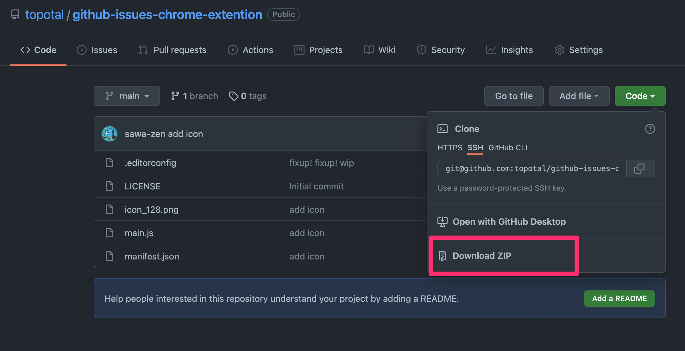
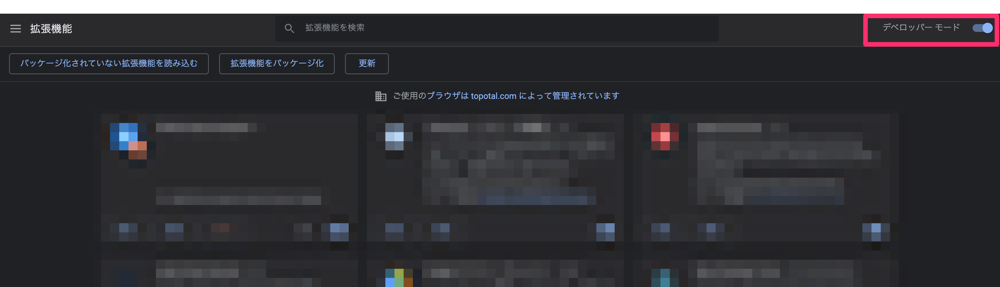
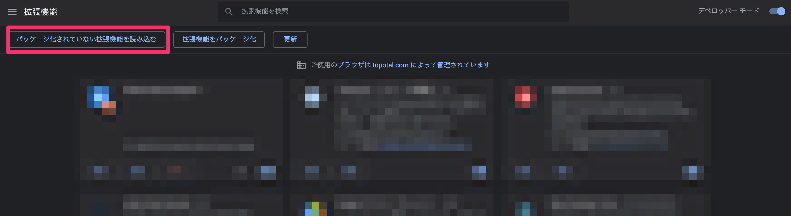

# github-issues-chrome-extention

An extension for summing numbers on the GitHub issues screen

## How to install

1. Download zip file
    
1. Unzip file
1. Go to [chrome://extensions](chrome://extensions)
1. Turn on the developer mode
    
1. Click "Load Unpackaged Extensions".
    
1. Select the file you unzipped in step 2.
1. Go to GItHub issues page
1. When the Extention icon glows, you are done 🎉
    

## How to use

1. Add a column of numbers named `Story Point`
1. Create an issue and set a story point for each
1. Grouping by milestone or status
1. Then the header will show the total value for that group.
    
