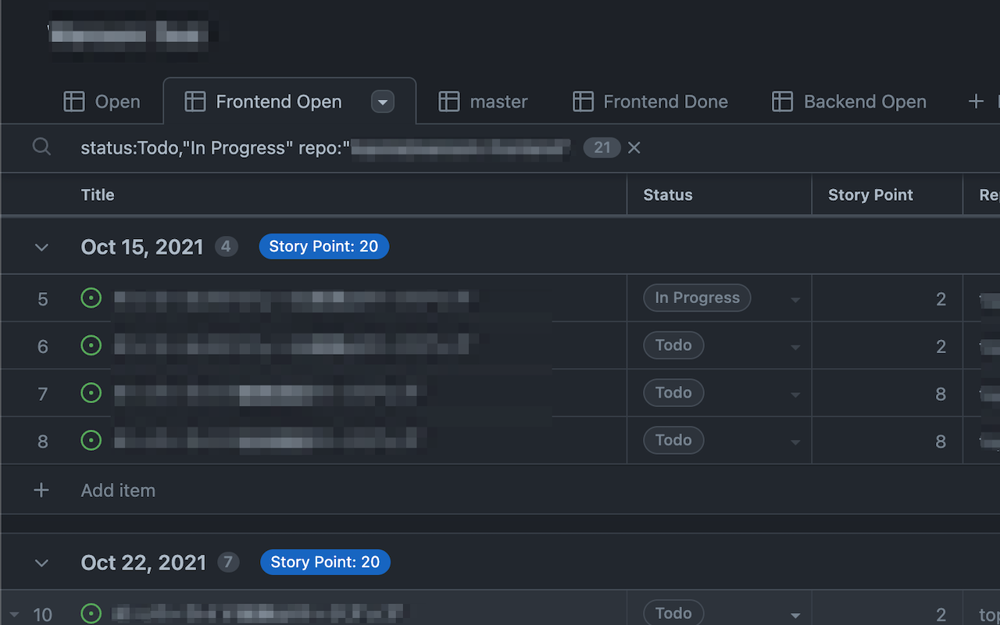
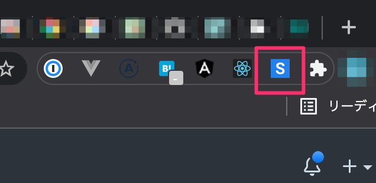
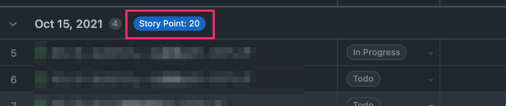

# github-issues-chrome-extention

An extension for summing numbers on the GitHub issues screen

## How to install

1. Install from Chrome Web Store:
- https://chrome.google.com/webstore/detail/github-issues-storypoint/nifjdpcdgmfoapaochhpljgmcmndceoh/related
1. When the Extention icon glows, you are done 🎉
    

## How to use

1. Add a column of numbers named `Story Point`
1. Create an issue and set a story point for each
1. Grouping by milestone or status
1. Then the header will show the total value for that group.
    

## How to develop

開発中の拡張アプリは以下の手順でインストールして試すことができます
1. chrome://extensions/ のページへ遷移
1. このリポジトリのディレクトリ毎開いたページへドラッグ・アンド・ドロップ
